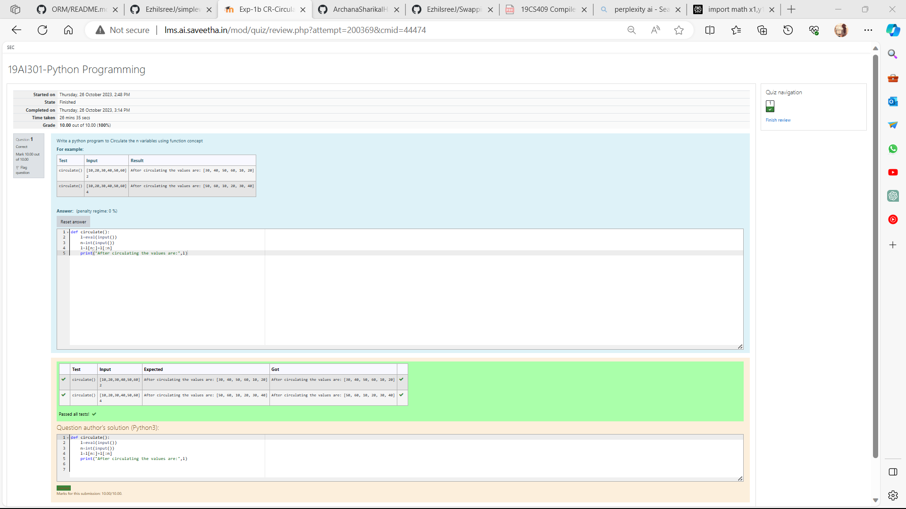

# Circulate-the-values-of-N-variables
## Aim:
To write a python program to circulate the n variables using function concept
## Equipment’s required:
PC
Anaconda - Python 3.7
## Algorithm: 
### Step 1:
Define a function called `circulate()` using `def circulate():`. 
### Step 2:
Take two variables Declare first variable as eval and second one as integer and get input from them.
### Step 3: 
Get the value from the user for the number of rotation.
### Step 4: 
Using the slicing concept rotate the list.
### Step 5: 
Print the circulated list to the console.
### Step 6: 
End the program.
## Program:
```py
def circulate():
    l=eval(input())
    n=int(input())
    l=l[n:]+l[:n]
    print("After circulating the values are:",l)```

## Output:


## Result:
Thus circulating the values of n variables program successfully executed.